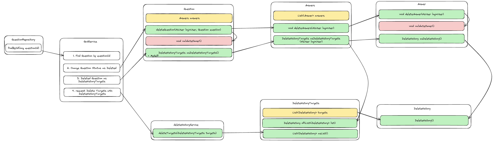
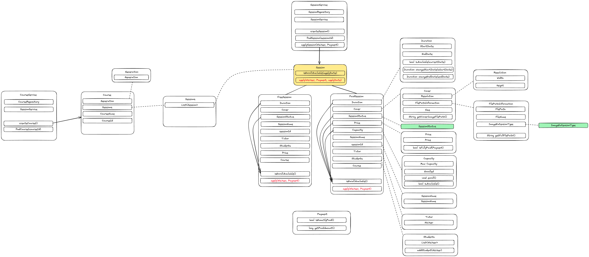
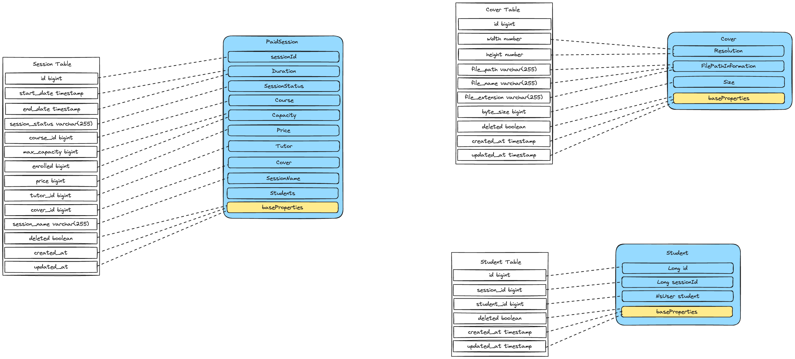
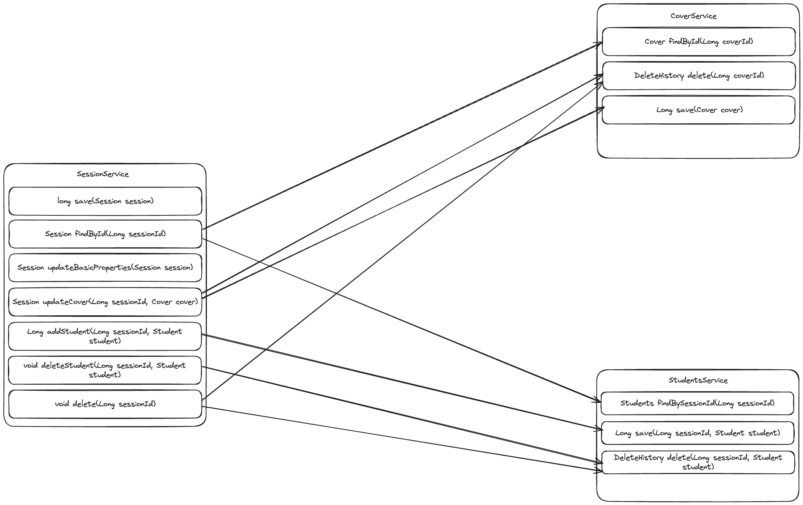

# 학습 관리 시스템(Learning Management System)
## 진행 방법
* 학습 관리 시스템의 수강신청 요구사항을 파악한다.
* 요구사항에 대한 구현을 완료한 후 자신의 github 아이디에 해당하는 브랜치에 Pull Request(이하 PR)를 통해 코드 리뷰 요청을 한다.
* 코드 리뷰 피드백에 대한 개선 작업을 하고 다시 PUSH한다.
* 모든 피드백을 완료하면 다음 단계를 도전하고 앞의 과정을 반복한다.

## 온라인 코드 리뷰 과정
* [텍스트와 이미지로 살펴보는 온라인 코드 리뷰 과정](https://github.com/next-step/nextstep-docs/tree/master/codereview)

# 질문 삭제하기 요구 사항
- 질문 데이터를 완전히 삭제하는 것이 아니라 데이터의 상태를 삭제 상태(deleted - boolean type)로 변경한다.
- 로그인 사용자와 질문한 사람이 같은 경우 삭제 가능하다.
- 답변이 없는 경우 삭제가 가능하다.
- 질문자와 답변글의 모든 답변자 같은경우 삭제가 가능하다.
- 질문을 삭제할 때 답변 또한 삭제해야 하며, 답변의 삭제 또한 삭제 상태(deleted)를 변경한다.
- 질문자와 답변자가 다른경우 답변을 삭제할 수 없다.
- 질문과 답변 삭제 이력에 대한 정보를 DeleteHistory를 활용해 남긴다.

# 리팩터링 요구사항
- `nextstep.qna.service.QnaService`의 `deleteQuestion()`는 앞의 질문 삭제 기능을 구현한 코드이다. 이 메소드는 단위 테스트하기 어려운 코드와 단위 테스트 가능한 코드가 섞여 있다.
- `QnaService`의 `deleteQuestion()` 메서드에 단위 테스트 가능한 코드(핵심 비지니스 로직)를 도메인 모델 객체에 구현한다.
- `QnaService`의 비지니스 로직을 도메인 모델로 이동하는 리팩터링을 진행할 때 TDD로 구현한다.
- `QnaService`의 `deleteQuestion()` 메서드에 대한 단위 테스트는 `src/test/java` 폴더 `nextstep.qna.service.QnaServiceTest`이다. 도메인 모델로 로직을 이동한 후에도 `QnaServiceTest`의 모든 테스트는 통과해야 한다.

# 현재 기능 사항
- `questionId`로 질문을 조회한다.
  - 없다면 `NotFoundException`을 던진다.
- 조회한 `question`의 작성자와 `longinUser`를 비교하여 작성자가 아니라면 `CannotDeleteException`을 던진다.

- 조회한 `question`에서 `answer` 목록을 가져온다.
- 답글의 작성자가 `loginUser`와 일치하지 않는다면 `CannotDeleteException`을 던진다.

- 조회한 `question`의 상태를 Delete 처리한다.
- 삭제 히스토리에 삭제 리스트를 추가한다.
- 조회한 `answer` 목록에 대해 상태를 Delete 처리한다.
- 삭제 히스토리에 삭제 리스트를 추가한다.
- 삭제 히스토리의 저장을 수행한다.

# 구현 객체들의 협력 Flow(리팩토링)

# 리팩토링 리스트
- [x] DeleteHistoryTargets 일급 컬렉션 구현
- [x] DeleteHistory 서비스의 DeleteHistoryTargets에 대한 삭제 구현
- [x] Answer 일급 컬렉션 구현
- [x] Question 삭제 상태 변경 구현
- [x] Question 삭제 리스트 반환 구현

# 수강 신청
- 도메인 역할 도표
  

- [x] ImageExtensionType
- [x] FilePathInformation
- [x] Resolution
- [x] Cover
- [x] Duration
- [x] Price
- [x] Capacity
- [x] Tutor
- [x] SessionStatusType
- [x] SessionStatus
- [x] Students
- [x] SessionName
- [x] Payment
- [x] GeneralPayment
- [x] FreePayment
- [x] Session
- [x] FreeSession
- [x] PaidSession
- [x] Sessions
- [x] Generation
- [x] Course
- [ ] SessionService
- [ ] CourseService

# 수강신청 DB 매핑
- 목적 : CRUD 기능 구현
### Service의 책임 Flow

### Table 설계

### 구현 기능
- [x] 이전 과제 코드리뷰 - `Session` 검증 메서드 이름 명확화
- [x] `DeleteHistory`를 `common` 패키지로 이관
- [x] `common`에 `BaseEntity` 클래스 구현
  - 삭제 상태
  - 생성 일자
  - 수정 일자
- [x] `Student` 객체 구성
- [x] `Cover` 책임 인터페이스 구현
- [x] `Students` 책임 인터페이스 구현
- [x] `Session` - `save` 구현
  - 협력 객체로 `Cover`만을 넣은 `Session`을 생성한다.
- [x] `Session` - `findById(Long sessionId)` 구현
  - 조회한 결과로 아래를 판단한다.
    - `cover_id`가 존재할 경우, `Cover`의 `findById`로 메시지를 보내 조회하여 매핑한다.
    - `Students`에서 `session_id`로 `findAllStudentsBySessionId`로 메시지를 보내 전체 학생을 가져와 매핑한다.
    - 가격에 따라 `FreeSession`, `PaidSession`을 구분하여 매핑한다.
    - `Session` 객체를 반환한다.
- [x] `Session` - `Session updateBasicProperties(Session session)` 구현
  - `startDate`에 대해 변경한다.
  - `endDate`에 대해 변경한다.
  - `sessionName`에 대해 변역한다.
  - 변경분에 대해 저장한다.
  - 저장한 `Session` 객체를 반환한다.
- [x] `Session` - `Session updateCover(Long sessionId, Cover cover)` 구현
  - `sessionId`를 통해 `Session` 객체를 조회한다.
  - 기존의 `Cover`에게 `delete` 메시지를 보낸다.
  - `Cover`에게 `save` 메시지를 보내 생성한다.
  - 현재 `Session`의 `Cover`를 변경한다.
  - 현재 `Session`을 변경 저장한다.
- [x] `Session` - `addStudent(Long sessionId, Student student)` 구현
  - `sessionId`를 통해 `Session` 객체를 조회한다.
  - 조회한 `Session` 객체의 `Students`에 `student`를 추가한다.
  - `StudentsService`에게 `save` 메시지를 보낸다.
- [x] `Session` - `deleteStudent(Long sessionId, Student student)` 구현
  - `sessionId`를 통해 `Session` 객체를 조회한다.
  - 조회한 `Session` 객체의 `Students`에 `student`를 제거한다.
  - `StudentsService`에게 `delete` 메시지를 보낸다.
- [x] `Session` - `delete(Long sessionId)` 구현
  - `sessionId`를 통해 `Session` 객체를 조회한다.
  - 삭제할 수 있는지 검증한다.
  - `Sesssion`객체가 가지고 있는 `Cover`에 삭제 메시지를 보낸다.
  - `Students`에 삭제 메시지를 보낸다.
  - `Session`의 상태를 삭제로 변경한다.
  - `DeleteHistories`를 저장한다.
- [x] `Cover` - `findById(Long coverId)` 구현
  - 파라미터의 `coverId`로 조회한다.
  - 조회된 `Cover` 객체를 반환한다.
- [x] `Cover` - `save(Cover cover)` 구현
  - 파라미터의 `Cover`를 저장한다.
  - 저장한 Id값을 반환한다.
- [x] `Cover` - `delete(Long coverId)` 구현
  - 삭제상태를 변경한다.
  - `DeleteHistory`를 반환한다.
- [x] `Student` - `findAllStudentsBySessionId(Long sessionId)` 구현
  - `sessionId`를 통해 삭제상태가 아닌 학생들을 모두 조회한다.
  - `Student` 객체에 담아 반환한다.
- [x] `Student` - `save(Long sessionId, Student studet)` 구현
  - `sessionId`를 기준으로, `Student`를 저장한다.
  - 저장한 `student`의 Id를 반환한다.
- [x] `Student` - `delete(Long sessionId, Student studetn)` 구현
  - `Student`를 조회한다.
  - 해당 `Student`의 상태를 삭제로 변경한다.
  - `DeleteHistory`를 반환한다.

- [x] 모집 상태 추가
  - 기존 `SessionStatus`에, 모집상태를 추가한다.
  - 수강 신청 조건에 모집상태 조건을 적용한다.
- [ ] 다중 강의 커버 정보 적용
  - `UpdateCover` 관련 기능을 제거한다.
  - `Covers` 일급 컬렉션을 사용한다.
- [ ] 학생 승인/거절 기능 추가
  - 학생 승인/거절 상태를 추가한다.
