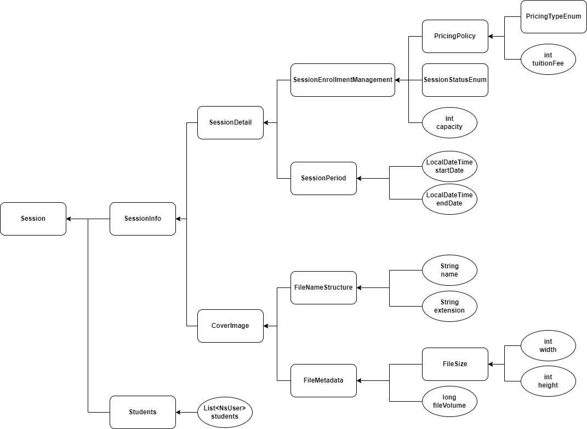

# 학습 관리 시스템(Learning Management System)

## LMS 기능목록

### Parser
- [x] 파일명이 없을경우 예외발생
- [x] 확장자가 없을경우 예외발생

### PricingPolicy
- [x] 수강생이 결제한 금액과 유료강의 수강료가 다를때 때 예외발생

### Student
- [x] 수강생 추가 가능
- [x] 중복 수강신청시 예외 발생
- [x] 유료강의 최대 수강 인원을 초과한다면 예외 발생

### SessionEnrollmentManagement
- [x] 강의 모집상태가 모집중이 아닐경우 수강생 등록 시 예외발생
- [x] 모집중인 무료 강의 수강생 등록 가능
- [x] 모집중인 유료 강의 수강생 등록 가능
- [x] 모집중인 유료 강의 수강생 초과시 예외발생

### FileNameStructure
- [x] 파일 확장자가 지원하지 않는 확장자라면 예외 발생

### FileMetadata
- [x] 파일용량이 허용 최대 용량보다 크다면 예외 발생

### FileSize
- [x] 파일 너비가 최소 너비보다 작다면 예외발생
- [x] 파일 높이가 최소 높이보다 작다면 예외발생
- [x] 파일 비율이 지원하지 않는 비율이라면 예외발생

### SessionPeriod
- [x] 강의 시작 후에는 수강신청 불가능

### PricingTypeEnum
- [x] 유료강의인지 확인

### Payment
- [x] 금액이 다른지 확인

---
## Q&A 기능목록
- [x] 본인이 질문한 질문이 아닌데 삭제하려고 할 경우 CannotDeleteException 발생
- [x] 질문에 답변자가 다른사람이 한명이라도 있다면 CannotDeleteException 발생
- [x] 답변의 작성자가 아닌데 삭제하려고 할 경우 CannotDeleteException 발생
- [x] 질문을 삭제하면 List<DeleteHistory>를 리턴한다.
- [x] 답변을 삭제하면 DeleteHistory를 리턴한다.
- [x] Answers 객체에 Answer를 추가한다.
- [x] 답변 작성자가 모두 일치한다면 true, 아니면 false리턴.
- [x] 모든 답변을 삭제하면 List<DeleteHistory>를 리턴한다.
