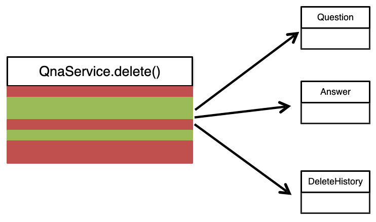
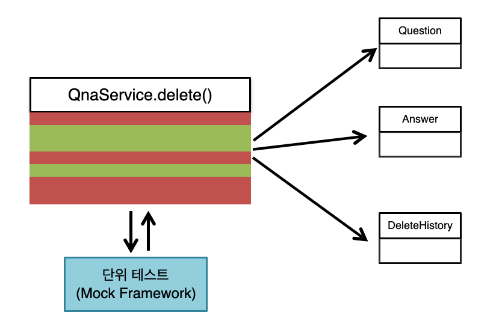
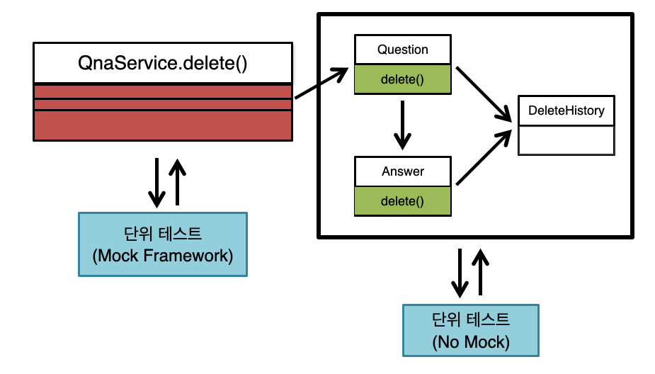

# 🚀 1단계 - 레거시 코드 리팩터링

# 질문 삭제하기 요구사항
- 질문 데이터를 완전히 삭제하는 것이 아니라 데이터의 상태를 삭제 상태(deleted - boolean type)로 변경한다.
- 로그인 사용자와 질문한 사람이 같은 경우 삭제 가능하다.
- 답변이 없는 경우 삭제가 가능하다.
- 질문자와 답변글의 모든답변자가 같은 경우 삭제가 가능하다.
- 질문을 삭제할 때 답변 또한 삭제해야 하며, 답변의 삭제 또한 삭제 상태 (deleted) 를 변경 한다.
- 질문자와 답변자가 다른경우 답변을 삭제할 수 없다.
- 질문과 답변 삭제 이력에 대한 정보를 DeleteHistory 를 활용해 남긴다.

# 리팩터링 요구사항
- nextstep.qna.service.QnaService 의 deleteQuestion()는 앞의 질문 삭제 기능을 구현한 코드이다.
- 이 메소드는 단위 테스트하기 어려운 코드와 단위 테스트 가능한 코드가 섞여 있다.
- QnaService 의 deleteQuestion() 메서드에 단위 테스트 가능한 코드(핵심 비지니스 로직)를 도메인 모델 객체에 구현한다.
- QnaService 의 비지니스 로직을 도메인 모델로 이동하는 리팩터링을 진행할 때 TDD 로 구현한다.
- QnaService 의 deleteQuestion() 메서드에 대한 단위 테스트는 src/test/java 폴더 nextstep.qna.service.QnaServiceTest 이다.
- 도메인 모델로 로직을 이동한 후에도 QnaServiceTest 의 모든 테스트는 통과해야 한다.


```java
public class QnAService {
    public void deleteQuestion(NsUser loginUser, long questionId) throws CannotDeleteException {
        Question question = questionRepository.findById(questionId).orElseThrow(NotFoundException::new);
        if (!question.isOwner(loginUser)) {
            throw new CannotDeleteException("질문을 삭제할 권한이 없습니다.");
        }

        List<Answer> answers = question.getAnswers();
        for (Answer answer : answers) {
            if (!answer.isOwner(loginUser)) {
                throw new CannotDeleteException("다른 사람이 쓴 답변이 있어 삭제할 수 없습니다.");
            }
        }

        List<DeleteHistory> deleteHistories = new ArrayList<>();
        question.setDeleted(true);
        deleteHistories.add(new DeleteHistory(ContentType.QUESTION, questionId, question.getWriter(), LocalDateTime.now()));
        for (Answer answer : answers) {
            answer.setDeleted(true);
            deleteHistories.add(new DeleteHistory(ContentType.ANSWER, answer.getId(), answer.getWriter(), LocalDateTime.now()));
        }
        deleteHistoryService.saveAll(deleteHistories);
    }
}
```

# Service -> 도메인 모델 리팩터링
- AS-IS





- TO-BE




# 힌트
- 객체의 상태 데이터를 꺼내지 (get) 말고 메시지를 보낸다.
- 규칙 8: 일급 콜렉션을 쓴다.
- Question 의 List 를 일급 콜렉션으로 구현해 본다.
- 규칙 7: 3개 이상의 인스턴스 변수를 가진 클래스를 쓰지 않는다.
- 인스턴스 변수의 수를 줄이기 위해 도전한다.
- 도메인 모델에 setter 메서드 추가하지 않는다.


# TO-DO
- [x] 도메인 모델로 비지니스 로직을 이동한다.
  - [x] Question
    - [x] questionRepository.findById 메서드로 분리하기
    - [x] validation 은 도메인으로 이동시키고 단위테스트 작성하기
  - [x] Answer
    - [x] validation 은 도메인으로 이동시키고 단위테스트 작성하기
- [x] 비지니스 로직을 이동한 후에도 테스트가 통과하는지 확인한다.