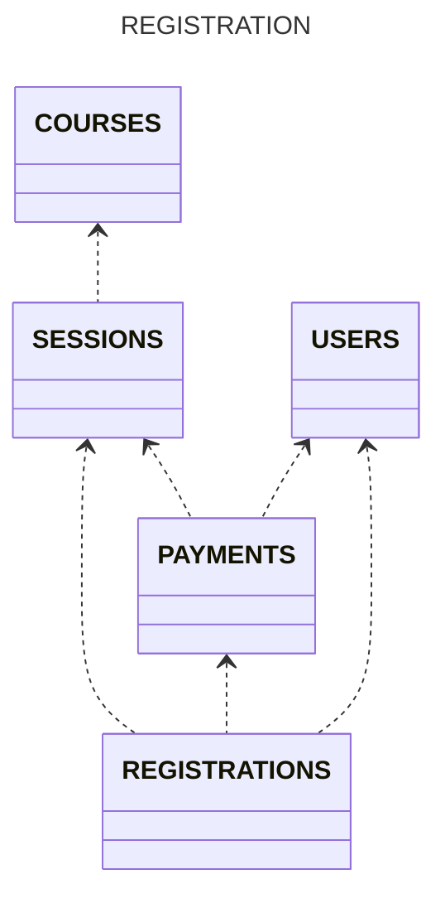

# 수강 신청(도메인 모델)

## I. 도메인 설계 및 비즈니스 로직

### 1. 과정(Courses)

> 여러 강의를 묶는 책임을 수행한다.
> 같은 과정 혹은 과정과 기수가 모두 같은 여러 강의에게 공통적인 속성을 부여할 수 있다.

- 기수 단위 운영
- 여러 개 강의를 가질 수 있음

### 2. 강의(Sessions)

> 과정에 속하며, 신청 받을 책임을 수행한다.
> 강의에 대한 정보와 상태를 가진다.
> 강의 정보 등록에 대한 검증을 수행한다.

- [ ] 시작일/종료일을 가짐
- [ ] 강의 커버 이미지 정보를 가짐
    - [ ] 이미지 파일 크기 제한: 1MB 이하
    - [ ] 이미지 타입 제한(gif, jpg, jpeg, png, svg)
    - [ ] 이미지 크기 제한: width(300px), height(200px), 3:2 비율
- [ ] 강의 구분(무료/유료)
    - 무료 강의
        - 인원 제한 없음
    - 유료 강의
        - 수강 인원 제한: 강의 최대 인원 이하
        - 수강 신청 제한: 수강생이 결제한 금액 = 수강료
- [ ] 강의 상태(준비중/모집중/종료)
    - 수강 신청 제한: 모집중일 때만 가능

### 3. 수강 신청(Registrations)

> 강의 신청 가능 상태와 결제 금액을 검증하고, 신청을 처리하는 책임을 수행한다.
> 특정 강의에 대한 신청자 정보를 가진다.

- [ ] 강의 신청 가능 상태 확인
    - [ ] 인원 제한 확인: 강의 최대 인원 이하
    - [ ] 강의 상태 확인: 모집중
- [ ] 수강료 결제 금액 확인
    - 수강생이 결제한 금액 = 수강료
- [ ] 신청 이력 등록

### 4. 결제(Payments)

> 사용자의 수강료를 계산하는 책임을 수행한다.
> 특정 강의에 대한 사용자의 결제 상태를 가진다.

- 결제는 이미 완료한 것으로 가정
- 결제 정보는 Payments 모듈을 통해 관리되고, Payment 객체에 담겨 반환

### 5. 사용자(Users)

> 수강 신청, 결제에 대한 주체 역할을 수행한다.

 

## II. 도메인 관계 설계

- [x] 도메인 관계 다이어그램

