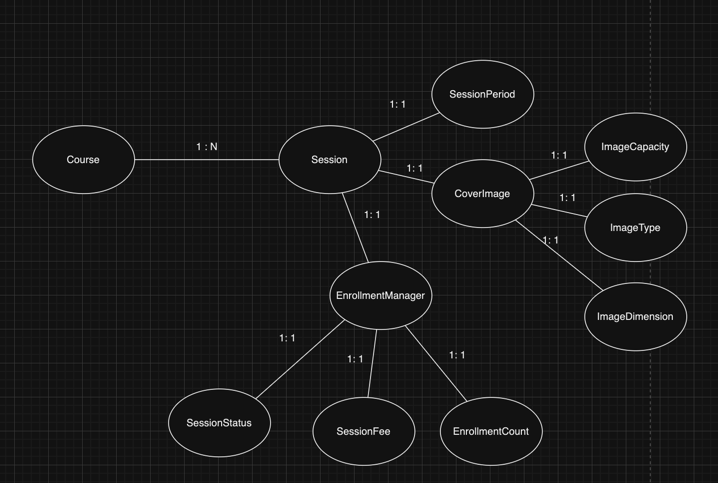
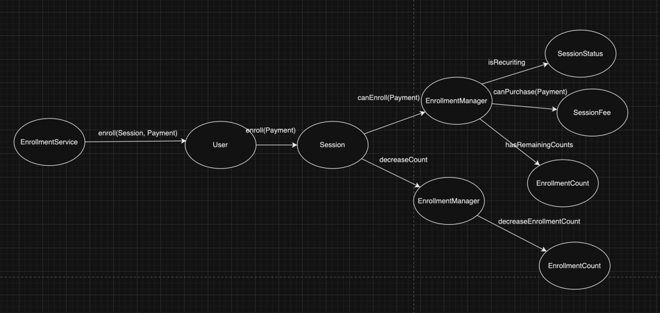

# Step 2

### 도메인 모델링

### 수강신청 내부 도메인간의 협력

## Todo

## Done

- [X] 1단계 코드 리뷰 반영 - Question,DeleteHistory createdAt 생성자에서 기본값 세팅
- [X] 1단계 코드 리뷰 반영 - Answer > delete내부의 변수명 변경 (owner -> isOwner)
- [X] 1단계 코드 리뷰 반영 - 일급 컬렉션 Answers 테스트 코드 추가

### Session > CoverImage > ImageCapacity

- [X] 이미지 크기는 1MB 이하여야 한다.

### Session > CoverImage > ImageType

- [X] 이미지 타입은 gif, jpg(jpeg 포함),, png, svg만 허용한다.

### Session > CoverImage > ImageDimension

- [X] 이미지의 width는 300픽셀, height는 200픽셀 이상이어야 하며, width와 height의 비율은 3:2여야 한다.

### Session > SessionStatus

- [X] 강의 상태는 준비중, 모집중, 종료 3가지 상태를 가진다.
- [X] 강의 수강신청은 강의 상태가 모집중일 때만 가능하다.

### Session > EnrollmentManager

- [X] 무료 강의는 최대 수강 인원 제한이 없다.
- [X] 유료 강의는 강의 최대 수강 인원을 초과할 수 없다.
- [X] 유료 강의는 수강생이 결제한 금액과 수강료가 일치할 때 수강 신청이 가능하다.

# Step 3

## 코드 리뷰 TODO
- [ ] Repository 내에서 쿼리들을 대문자로 수정
- [ ] RepositoryTest 내에서 log 출력하는 코드 삭제
- [ ] Course 조회 시에 Session도 같이 조회하도록 수정
- [ ] CoverImage가 Session id가 아닌 Session을 참조하도록 수정

## 코드 리뷰 DONE
- [X] JdbcSessionRepository에서 Session 조회 시에 CoverImage도 join으로 같이 조회하도록 수정
- [X] CoverImage의 getter에서 원시값을 반환하도록 수정
