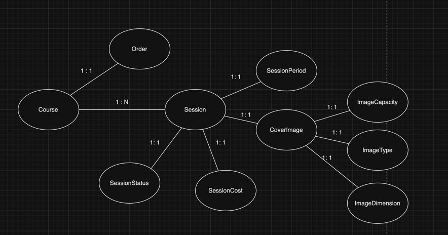
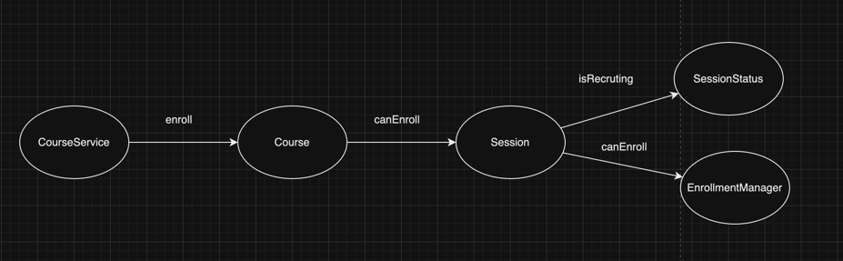

# Step1

## Todo

## Done
- [X] 질문한 사람이 로그인한 본인이 아닐 경우에 삭제가 불가능
- [X] 답변이 있으며 질문자와 답변글이 다른 경우 삭제가 불가능
- [X] 질문자가 본인이며 답변이 없으면 삭제가 가능
- [X] 질문 삭제 시에 데이터의 상태를 삭제 상태(deleted - boolean type)로 변경
- [X] 질문자가 로그인한 본인일 경우에 삭제가 가능
- [X] 답변이 있으며 질문자와 답변글이 모두 로그인한 사용자이면 삭제가 가능
- [X] 답변 삭제 시에 데이터의 상태를 삭제 상태(deleted - boolean type)로 변경
- [X] 질문과 답변 삭제 이력에 대한 정보를 DeleteHistory를 활용해 남긴다.
- [X] 코드 리뷰 반영 - 생성자들 중에서 해당 클래스 내부에서만 사용되는 생성자들 접근 지정자를 private으로 지정
- [X] 코드 리뷰 반영 - 이름 변경 saveDeletedHistory -> generateDeletedHistory
- [X] 코드 리뷰 반영 - CannotDeleteException RuntimeException으로 변경

# Step 2

## Todo

### 도메인 모델링

### 수강신청 내부 도메인간의 협력

### Course > Order
- [ ] 하나의 Course는 기수단위로 운영된다.

### Session > CoverImage > ImageDimension
- [ ] 이미지의 width는 300픽셀, height는 200픽셀 이상이어야 하며, width와 height의 비율은 3:2여야 한다.

### Session > EnrollmentManager
- [ ] 무료 강의는 최대 수강 인원 제한이 없다.
- [ ] 유료 강의는 강의 최대 수강 인원을 초과할 수 없다.
- [ ] 유료 강의는 수강생이 결제한 금액과 수강료가 일치할 때 수강 신청이 가능하다.

### Session > SessionStatus
- [ ] 강의 상태는 준비중, 모집중, 종료 3가지 상태를 가진다.
- [ ] 강의 수강신청은 강의 상태가 모집중일 때만 가능하다.

## Done
- [X] 1단계 코드 리뷰 반영 - Question,DeleteHistory createdAt 생성자에서 기본값 세팅
- [X] 1단계 코드 리뷰 반영 - Answer > delete내부의 변수명 변경 (owner -> isOwner)
- [X] 1단계 코드 리뷰 반영 - 일급 컬렉션 Answers 테스트 코드 추가
### Session > CoverImage > ImageCapacity
- [X] 이미지 크기는 1MB 이하여야 한다.
### Session > CoverImage > ImageType
- [X] 이미지 타입은 gif, jpg(jpeg 포함),, png, svg만 허용한다.
