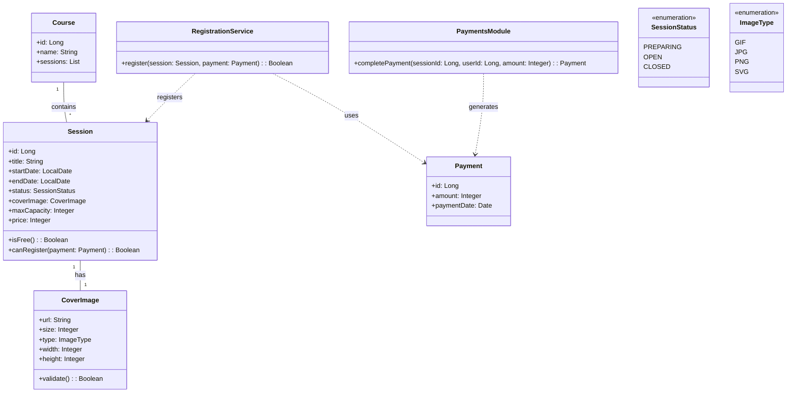

```mermaid
classDiagram
    
class Course {
  +id: Long
  +name: String
  +sessions: List<Session>
}

class Session {
  +id: Long
  +title: String
  +startDate: LocalDate
  +endDate: LocalDate
  +status: SessionStatus
  +coverImage: CoverImage
  +maxCapacity: Integer
  +price: Integer
  +isFree(): Boolean
  +canRegister(payment: Payment): Boolean
}

class CoverImage {
  +url: String
  +size: Integer
  +type: ImageType
  +width: Integer
  +height: Integer
  +validate(): Boolean
}

class Payment {
  +id: Long
  +amount: Integer
  +paymentDate: Date
}

class PaymentsModule {
  +completePayment(sessionId: Long, userId: Long, amount: Integer): Payment
}

class RegistrationService {
  +register(session: Session, payment: Payment): Boolean
}

class SessionStatus {
  <<enumeration>>
  PREPARING
  OPEN
  CLOSED
}

class ImageType {
  <<enumeration>>
  GIF
  JPG
  PNG
  SVG
}

Course "1" -- "*" Session : contains
Session "1" -- "1" CoverImage : has
RegistrationService ..> Session : registers
RegistrationService ..> Payment : uses
PaymentsModule ..> Payment : generates

```
